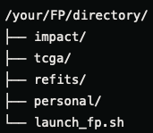
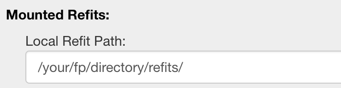

# Performing refits using HPC resources.
Facets Preview provides functionality for performing refits of data.  By default, running refits will use the computational resources of your local computer to perform these operations.  
This is not always practical, especially when dealing with larger data sets such as WES or WGS data.  In these cases, we often want to submit these jobs directly to the HPC cluster.  

Facets Preview has functionality to connect to terra and submit refit jobs directly to the cluster.  Follow the directions below to set up this feature.

In the initial installation step outlined in the [installation instructions](setup.md), you should have prepared a directory structure for Facets Preview as follows:

This document will address setting up your refits/ folder.

## Connect Facets Preview to Terra for HPC refits.
* Setup [macFUSE](https://osxfuse.github.io/) for running SSHFS mounts if you have not already done so.
* Add a mount command to your ~/.bash_profile on your local computer to mount the refits directory. `alias mountrefits='sudo umount -f /your/fp/directory/refits || sshfs YOUR-USER-ID@terra.mskcc.org:/juno/work/ccs/shared/resources/fp /your/fp/directory/refits -o auto_cache -o defer_permissions -o local -o IdentityFile=/Users/YOUR-USER-ID/.ssh/id_rsa -o reconnect -o transform_symlinks -o follow_symlinks'`
* Update your bash_profile. `source ~/.bash_profile`
* Mount the remote location. `mountrefits`. This will create a remote mount of the drive to your local drive, in this example at `/your/fp/directory/refits`. Note that you may need to execute this command twice, as the first execution attempt will sometimes ask for your local adminstrator password, and the second attempt will ask for your remote login credentials.
* When you next launch Facets Preview, on the session tab, you can setup your refits connection your mounted directory path.
*    
* Your refits should now be configurable to run locally or remotely.

