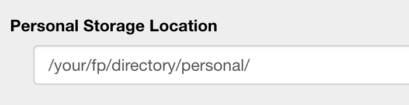

# Personal refits of institutional data.
Performing refits on institutional resources adds refits directly to our data repositories.  In order to keep our data clean and high quality, we therefore restrict access to refit functionality
when working with institutional resources.  While we do want researchers to contribute to refits of institutional repositories, sometimes there are cases where it is desirable to perform refits without 
altering the institutional data, such as when many experimental refits will need to be performed, or when a new user is learning to use the refit function.  In these cases, Facets Preview provides
the ability to make personal refits of institutional data.  

As this feature will require creating local copies of the data, it is also a restricted operation.  Please contact [Adam Price](pricea2@mskcc.org) to request the required password to access to this functionality.

Follow the directions below to set up this feature.

In the initial installation step outlined in the [installation instructions](setup.md), you should have prepared a directory structure for Facets Preview as follows:

This document will address setting up your personal/ folder.

## Connect Facets Preview to Terra for HPC refits.
* When you launch Facets Preview, on the session tab, you can setup your personal repository with your directory path.
*    
* Enter the password to enable personal refits in the password field. (Please contact [Adam Price](pricea2@mskcc.org) to request the required password to access to this functionality.)
* When viewing a Facets fit, you will now see "Storage Type" as a toggle in the left hand side panel of the "Review Fits" tab that shows data about the current sample.
* Toggle the switch from "Remote" to "Personal" and the remote data will be copied to your personal repository and refits functionality will be enabled.
* Refits performed on personal data will be saved to your system, and will not effect institutional resources.

